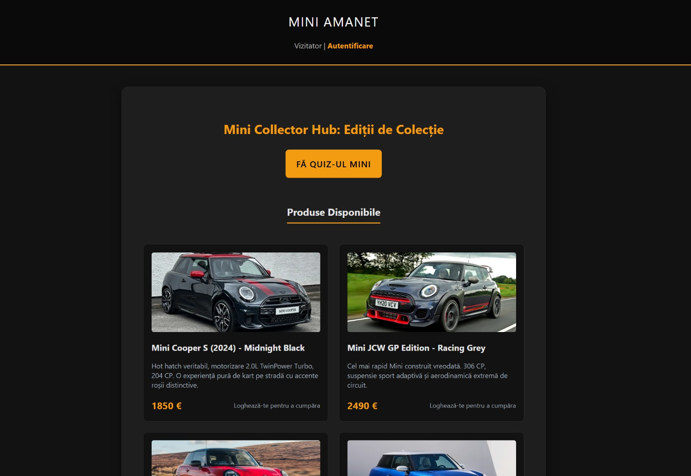
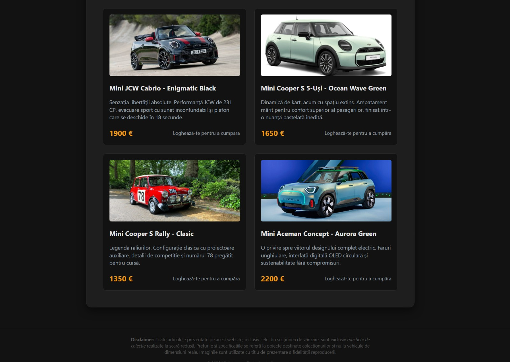
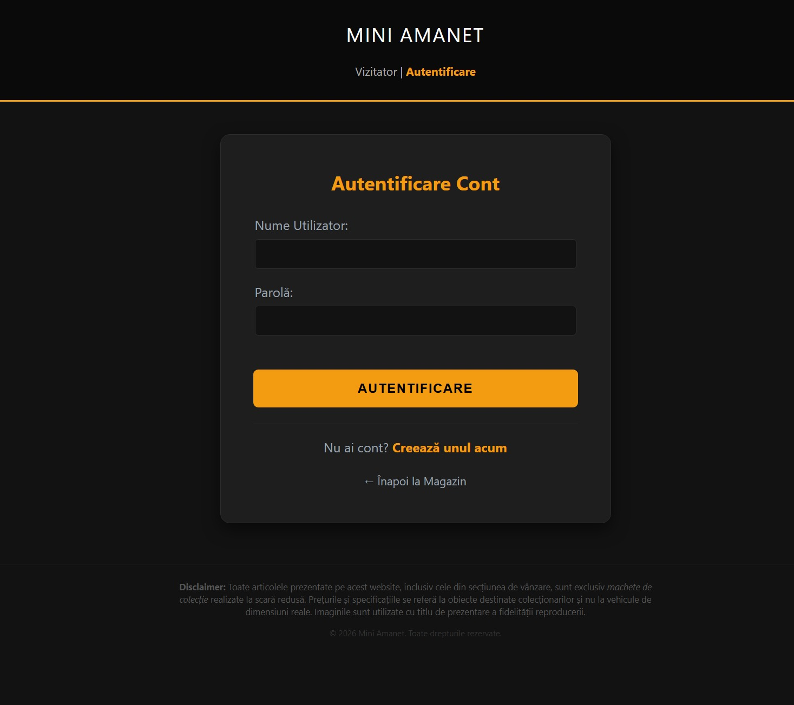
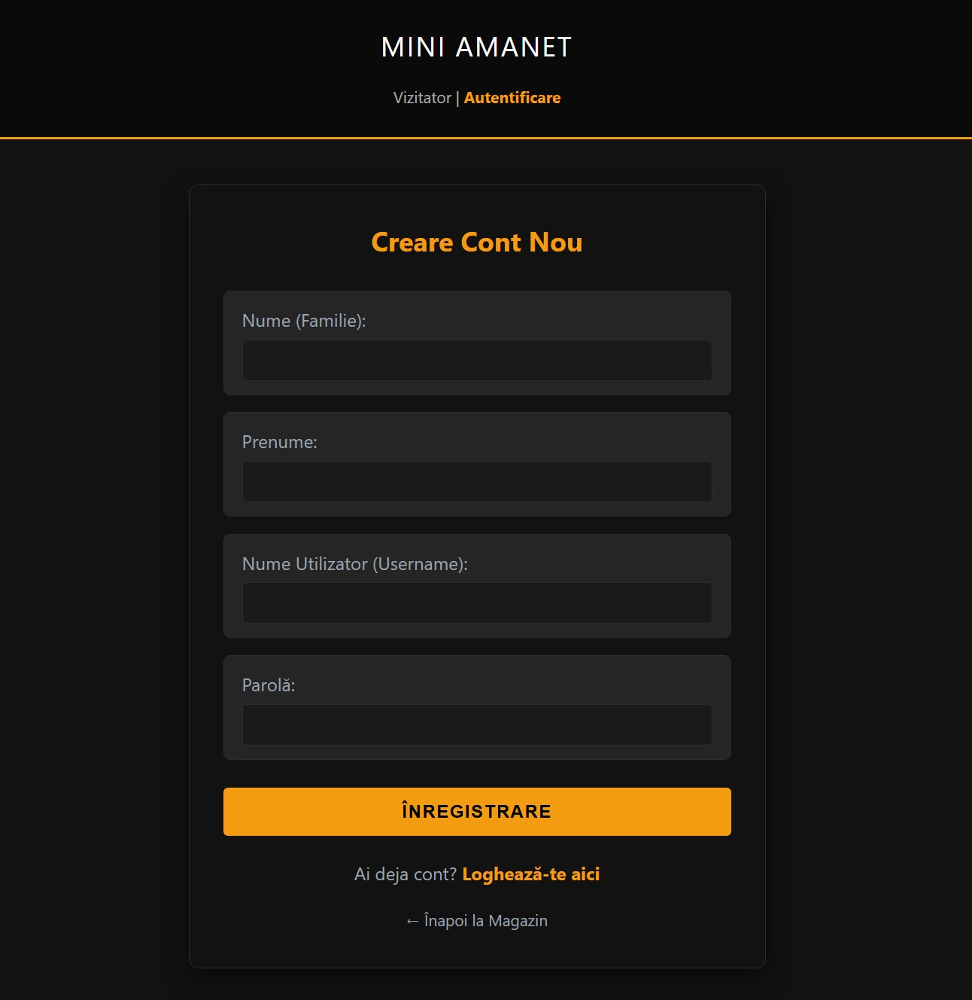
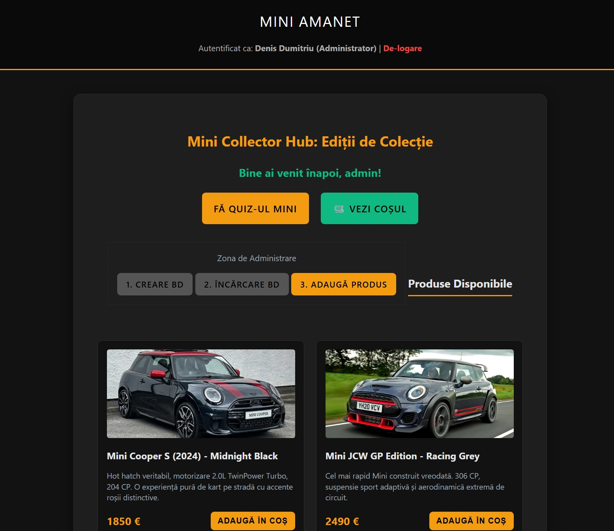
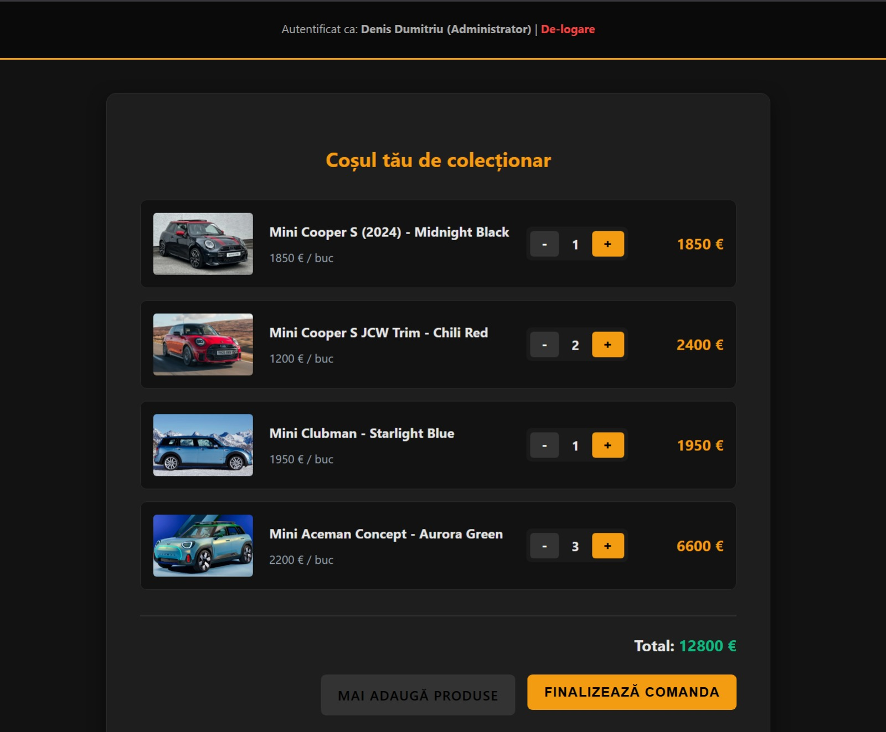
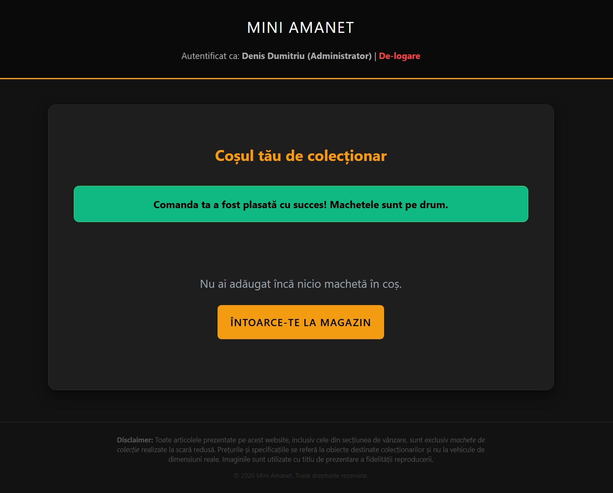
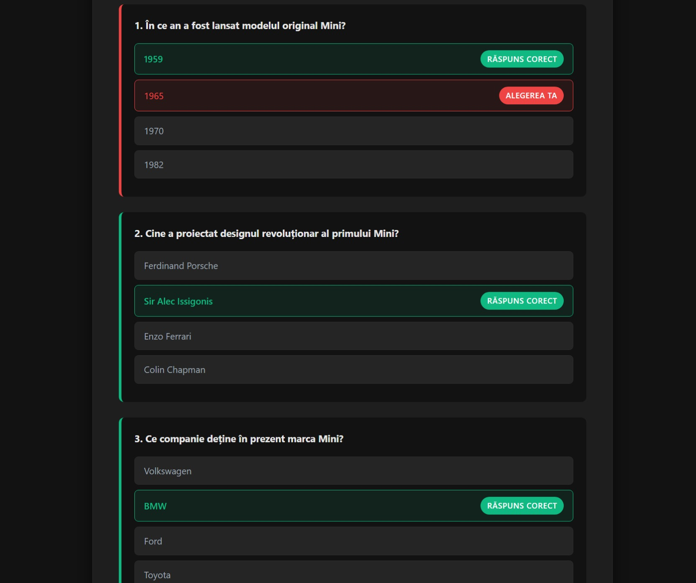
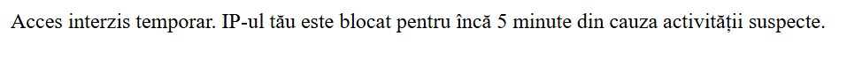

# Mini Amanet — Marketplace de Machete Mini Cooper

O aplicație web completă de tip marketplace, construită cu Node.js și Express, care simulează un magazin online de „automobile" Mini Cooper. Cei care citesc footer-ul vor descoperi că de fapt este vorba de machete de colecție la scară redusă. Restul — bine ați venit la Mini Amanet.

public/screenshots/welcome_andSomeProducts.jpg


---

## Profesor coordonator și student

| Rol | Nume |
|---|---|
| Profesor coordonator | *Bărbuța Delia* |
| Student | *Dumitriu Denis* |
**🌍 [Live Demo ](https://mini-amanet-webapp.onrender.com/)**
---

## Cuprins

- [Descriere generală](#descriere-generală)
- [Tehnologii folosite](#tehnologii-folosite)
- [Funcționalități](#funcționalități)
- [Capturi de ecran](#capturi-de-ecran)
- [Structura proiectului](#structura-proiectului)
- [Baza de date](#baza-de-date)
- [Securitate](#securitate)
- [Instalare și rulare](#instalare-și-rulare)
- [Credențiale implicite](#credențiale-implicite)
- [Utilitar auxiliar](#utilitar-auxiliar)
- [Profesor coordonator și student](#profesor-coordonator-și-student)

---

## Descriere generală

**Mini Amanet** este o aplicație web full-stack cu autentificare, coș de cumpărături, panou de administrare și un quiz interactiv despre istoria brandului Mini Cooper. Interfața are temă dark cu accent portocaliu/amber.

Aplicația rulează local pe portul `6789` și folosește SQLite ca bază de date, fără dependințe externe de server de baze de date.

---

## Tehnologii folosite

| Componentă | Tehnologie |
|---|---|
| Runtime | Node.js |
| Framework web | Express 5.x |
| Templating | EJS + express-ejs-layouts |
| Bază de date | SQLite3 |
| Autentificare parole | bcrypt |
| Sesiuni | express-session |
| Cookies | cookie-parser |
| Validare input | express-validator |
| Protecție CSRF | csurf |
| Stilizare | CSS custom (dark theme) |

---

## Funcționalități

### Catalog de produse
Pagina principală afișează o grilă cu 10 modele Mini Cooper, fiecare cu imagine, denumire, descriere și preț în euro. Produsele sunt stocate în baza de date și pot fi gestionate de administrator.

### Autentificare și înregistrare
- Creare cont nou cu nume, prenume, username și parolă
- Login/logout cu sesiune server-side
- Parolele sunt stocate exclusiv ca hash bcrypt (salt rounds: 10)
- Mesajele de eroare sunt transmise prin cookies cu clear automat după afișare (nu persistă la refresh)
- La login cu succes, cookie-ul de utilizator este setat pentru mesajul de bun-venit personalizat

### Coș de cumpărături
- Adăugare în coș fără reîncărcare pagină (fetch API + toast notification)
- Vizualizare coș cu produse grupate pe tip, cantitate și preț pe bucată
- Modificare cantitate direct din coș cu butoane `+` / `-`
- Calcul automat al totalului
- Finalizare comandă cu mesaj de confirmare

### Panou de administrare
Accesibil exclusiv utilizatorilor cu rolul `Administrator`, protejat atât la nivel de sesiune cât și prin token CSRF. Permite:
- Crearea tabelei `produse` în baza de date (`/creare-bd`)
- Încărcarea datelor inițiale (10 modele predefinite) (`/inserare-bd`)
- Adăugarea de produse noi cu validare server-side (prețul trebuie să fie strict > 1 €, numele trebuie să fie unic)

### Quiz Mini Cooper
- 10 întrebări despre istoria brandului Mini Cooper, citite dinamic dintr-un fișier JSON
- Adăugarea de noi întrebări se face exclusiv prin editarea `intrebari.json`, fără modificări în cod
- Pagina de rezultate afișează pentru fiecare întrebare variantele corecte și alegerea utilizatorului
- Scorul maxim obținut vreodată este salvat în baza de date per utilizator (se actualizează doar dacă scorul curent îl depășește pe cel salvat)
- Quiz-ul este accesibil și utilizatorilor neautentificați

---

## Capturi de ecran

### Pagina principală — vizitator
Utilizatorul neautentificat vede grila de produse cu imagini, denumiri, descrieri și prețuri. Butonul „Adaugă în coș" este înlocuit cu un mesaj care îl îndeamnă să se logheze. Este disponibil și accesul la quiz fără cont.



### Mai multe produse și footer-ul cu disclaimerul
Continuarea grilei de produse, cu ultimele modele din catalog. În subsolul paginii se află disclaimer-ul care dezvăluie, pentru cei atenți, că toate articolele sunt machete de colecție la scară redusă — nu vehicule reale.



### Autentificare
Formularul de login cu câmpuri pentru username și parolă. Erorile (utilizator greșit, parolă incorectă, IP blocat) sunt afișate printr-un banner roșu deasupra formularului. De aici se poate naviga și spre pagina de creare cont.



### Creare cont
Formularul de înregistrare solicită nume, prenume, username și parolă. Toate câmpurile sunt sanitizate pe server înainte de procesare, iar parola este stocată exclusiv ca hash bcrypt — niciodată în clar.



### Pagina principală — admin autentificat
Când un Administrator este logat, header-ul afișează numele complet și rolul său. Pe pagina principală apare zona de administrare cu trei butoane: creare tabelă, încărcare date inițiale și adăugare produs nou. Pe fiecare card de produs devine vizibil butonul „Adaugă în coș".



### Coș de cumpărături
Pagina coșului grupează produsele adăugate, afișând imaginea, prețul per bucată și cantitatea. Butoanele `+` și `-` modifică cantitatea direct din pagină, iar totalul se recalculează automat. De aici se poate finaliza comanda sau reveni în magazin.



### Confirmare comandă
După apăsarea butonului „Finalizează Comanda", coșul este golit din sesiune și utilizatorul este redirecționat înapoi la pagina coșului cu un banner verde de confirmare. Un mesaj îl invită să continue cumpărăturile.



### Rezultate quiz
Pagina de rezultate afișează întrebările una câte una, cu toate variantele de răspuns. Varianta corectă este marcată în verde cu badge-ul „Răspuns Corect", iar alegerea greșită a utilizatorului este marcată în roșu cu badge-ul „Alegerea ta". Scorul maxim este salvat automat în contul utilizatorului dacă este mai bun decât cel anterior.



### Blocare IP — protecție brute force
Dacă un IP acumulează prea multe tentative eșuate de login sau accesează în mod repetat rute inexistente, serverul returnează un mesaj `HTTP 429` cu timpul exact rămas până la deblocare. Blocarea crește progresiv cu fiecare nouă tentativă.



---

## Structura proiectului

```
Mini-amanet-webapp/
├── app.js                    # Punctul de intrare — toate rutele și logica serverului
├── reset_blacklist.js        # Script utilitar pentru deblocarea IP-urilor
├── intrebari.json            # Întrebările quiz-ului (editabil independent de cod)
├── cumparaturi.db            # Baza de date SQLite (generată automat la prima pornire)
├── package.json
├── public/
│   ├── style.css             # Stilizare globală (dark theme)
│   ├── images/               # Imaginile produselor (10 modele Mini Cooper)
│   └── screenshots/          # Capturi de ecran pentru documentație
├── views/
│   ├── layout.ejs            # Layout comun (header, footer, structura HTML)
│   ├── index.ejs             # Pagina principală cu grila de produse
│   ├── autentificare.ejs     # Formular login
│   ├── creare-cont.ejs       # Formular înregistrare
│   ├── admin.ejs             # Panou administrator — adăugare produs
│   ├── vizualizare-cos.ejs   # Coș de cumpărături
│   ├── chestionar.ejs        # Quiz cu întrebări radio
│   └── rezultat-chestionar.ejs # Pagina de rezultate cu detalii per întrebare
└── nefolosite/               # Fișiere experimentale neintegrate în aplicație
```

---

## Baza de date

Baza de date SQLite (`cumparaturi.db`) este creată automat la pornirea serverului dacă nu există. Conține trei tabele:

**`utilizatori`** — stochează conturile utilizatorilor

| Coloană | Tip | Detalii |
|---|---|---|
| id | INTEGER | PK, autoincrement |
| utilizator | TEXT | UNIQUE, username |
| parola | TEXT | hash bcrypt |
| nume | TEXT | — |
| prenume | TEXT | — |
| rol | TEXT | `User` sau `Administrator` |
| scor_maxim | INTEGER | Scorul maxim la quiz |

**`produse`** — catalogul de produse

| Coloană | Tip | Detalii |
|---|---|---|
| id | INTEGER | PK, autoincrement |
| nume | TEXT | UNIQUE |
| descriere | TEXT | — |
| pret | REAL | Prețul în euro |
| imagine | TEXT | Numele fișierului din `/public/images/` |

**`blacklist`** — gestionarea IP-urilor suspendate

| Coloană | Tip | Detalii |
|---|---|---|
| ip | TEXT | PK |
| login_fails | INTEGER | Număr tentative eșuate de login |
| scanner_fails | INTEGER | Număr accesări de rute inexistente |
| block_until | INTEGER | Timestamp UNIX până la care IP-ul este blocat |
| last_failed_at | INTEGER | Timestamp ultimului eșec |

---

## Securitate

Aplicația implementează mai multe straturi de protecție:

**Protecție brute force și blocare IP**

Un middleware global verifică la fiecare request dacă IP-ul solicitant este blocat. Blocarea se aplică în două scenarii:
- **Eșecuri la login:** după 5 tentative eșuate, IP-ul se blochează progresiv (`(login_fails - 4) * 5` minute). La 6 eșecuri = 5 minute, la 7 = 10 minute etc.
- **Scanare rute:** accesarea a 10 sau mai multe URL-uri inexistente în aceeași fereastră de 15 minute declanșează blocarea (`(scanner_fails - 9) * 15` minute).
- Contoarele se resetează automat dacă nu a existat activitate suspectă în ultimele 15 minute.

**Protecție CSRF**

Formularul de adăugare produs din panoul de admin folosește tokenuri CSRF generate cu middleware-ul `csurf`. Token-ul este inclus ca câmp hidden în formular și verificat la submit.

**Sanitizare input**

Toate câmpurile din formularele de login și înregistrare sunt procesate prin `express-validator` (`.trim().escape()`) înainte de a fi folosite, prevenind atacurile XSS.

**SQL Injection**

Toate interogările SQL folosesc parametri pregătiți (prepared statements) cu placeholder-uri `?`, fără interpolarea directă a valorilor din request.

**Cookies httpOnly**

Cookie-ul de sesiune este configurat cu `httpOnly: true`, prevenind accesul din JavaScript de pe client.

**Role-based access control**

Middleware-ul `verificareAdmin` verifică sesiunea și rolul utilizatorului înainte de a permite accesul la rutele `/admin` și `/admin/adaugare-produs`. Accesul neautorizat returnează `403 Forbidden`.

---

## Instalare și rulare

**Cerințe:** Node.js 18+ instalat pe sistem.

```bash
# Clonare repository
git clone https://github.com/HDR-2025-2026/proiect-2-Denis-Gabriel-Dumitriu.git
cd proiect-2-Denis-Gabriel-Dumitriu

# Instalare dependințe
npm install

# Pornire server
node app.js
```

Serverul pornește pe `http://localhost:6789`.

La prima pornire, baza de date este creată automat cu contul de administrator. Pentru a popula catalogul de produse, autentifică-te ca administrator și apasă butoanele **1. Creare BD** și **2. Încărcare BD** din pagina principală.

---

## Credențiale implicite

Dacă baza de date este goală la pornire, un cont de administrator este creat automat:

| Câmp | Valoare |
|---|---|
| Username | `admin` |
| Parolă | `minicooper123` |
| Rol | `Administrator` |

---

## Utilitar auxiliar

Fișierul `reset_blacklist.js` poate fi rulat independent pentru a șterge toate înregistrările din tabela `blacklist` și a debloca toate IP-urile:

```bash
node reset_blacklist.js
```

Util în scenarii de testare sau dacă propriul IP a fost blocat accidental în timpul dezvoltării.

---

*Disclaimer: Toate articolele prezentate pe acest website sunt exclusiv machete de colecție realizate la scară redusă. Prețurile și specificațiile se referă la obiecte destinate colecționarilor și nu la vehicule de dimensiuni reale. Dacă ați ajuns până aici, felicitări — faceți parte din cei 3% care citesc footer-ul.*
